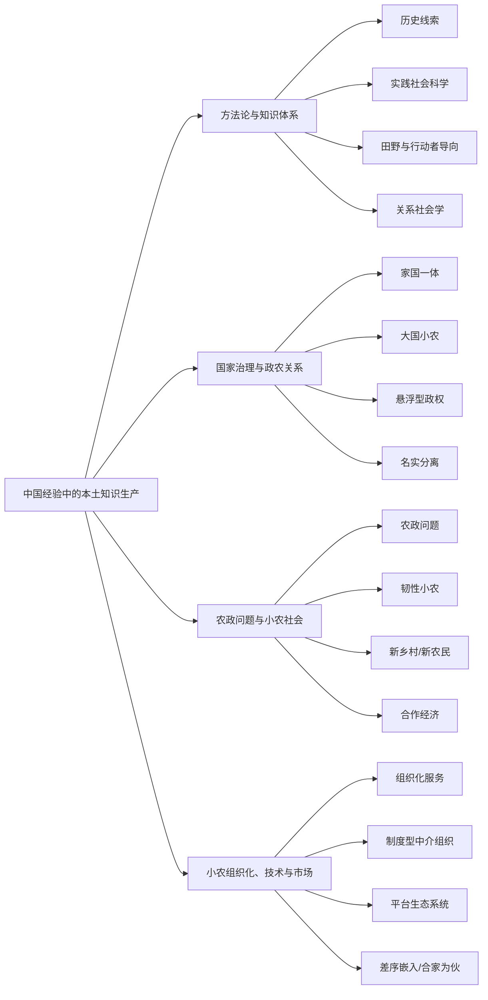

# 中文本土语境文献库总览

## 总体判断

这批文献共同指向一个核心任务：从中国经验内部提炼社会科学问题、概念和机制。它们并不是简单地“反西方理论”，而是在历史、田野、政策过程和乡土实践中，寻找可以与既有理论对话、也能说清中国经验的解释语言。

最重要的四个判断是：

1. 本土语境首先是历史和实践，不只是文化标签。周雪光的历史线索、黄宗智的实践社会科学、叶敬忠的田野方法和张文宏的关系社会学，都要求从真实过程里生成概念。
2. 国家与农民关系不是单一的控制或博弈。它可能表现为家国一体、悬浮化、名实分离、驻村帮扶、政策转译等多种形态。
3. 小农不是现代化叙事中的残余。农政问题、小农韧性、乡村续存和合作经济思想共同说明，小农是国家、市场、技术和家庭伦理交织中的行动主体。
4. 小农现代化的关键不是单纯“做大规模”，而是组织化。村集体、制度型中介组织、平台生态、科技小院、农机合伙都在回答“谁来组织小农、怎样组织、凭什么获得信任”。

## 主题地图

## 推荐阅读路径

入门路径：02 黄宗智 -> 01 周雪光 -> 20 张文宏 -> 07 叶敬忠。先建立“如何从中国经验生产知识”的方法论坐标。

政农关系路径：16 周飞舟 -> 10 陆汉文 -> 03 周飞舟 -> 04 周飞舟。可以看到从汲取、悬浮、风险规避到家国一体的关系谱系。

小农社会路径：05 叶敬忠 -> 06 叶敬忠 -> 11 李小云等 -> 14 徐进等 -> 15 周丹丹等。适合搭建“小农不是残余”的理论论证。

组织化路径：09 陈义媛 -> 13 文宏等 -> 12 汪旭晖等 -> 18 李琳等 -> 19 桑坤。适合写“小农如何与现代农业衔接”。

## 核心文献索引

| 编号 | 题名 | 作者 | 年份 | 主题组 | 关键词 |
|---|---|---|---|---|---|
| 01 | [寻找中国国家治理的历史线索](单篇笔记/01_周雪光_寻找中国国家治理的历史线索.md) | 周雪光 | 2019 | 本土方法论与国家治理 | 历史社会学、国家治理、基层治理、中国经验、制度连续性 |
| 02 | [“实践社会科学”研究进路：一个总结性的介绍和论析](单篇笔记/02_黄宗智_实践社会科学研究进路一个总结性的介绍和论析.md) | 黄宗智 | 2023 | 本土方法论与知识体系 | 实践社会科学、主客观二元、经验研究、理论建构、布迪厄 |
| 03 | [从脱贫攻坚到乡村振兴：迈向“家国一体”的国家与农民关系](单篇笔记/03_周飞舟_从脱贫攻坚到乡村振兴迈向家国一体的国家与农民关系.md) | 周飞舟 | 2021 | 国家治理与政农关系 | 脱贫攻坚、乡村振兴、家国一体、国家与农民关系、驻村帮扶 |
| 04 | [人民与家国：“大国小农”的治理逻辑](单篇笔记/04_周飞舟_人民与家国大国小农的治理逻辑.md) | 周飞舟 | 2025 | 国家治理与政农关系 | 人民性、大国小农、家国传统、土地制度、宗族 |
| 05 | [农政问题：概念演进与理论发展](单篇笔记/05_叶敬忠_农政问题概念演进与理论发展.md) | 叶敬忠 | 2022 | 农政问题与小农社会 | 农政问题、农政转型、马克思主义、实体主义、国家发展 |
| 06 | [农政问题：被忽视的学术概念及其传统](单篇笔记/06_叶敬忠_农政问题被忽视的学术概念及其传统.md) | 叶敬忠 | 2025 | 农政问题与小农社会 | 农政问题、知识考古、学术概念、三农问题、本土化与国际化 |
| 07 | [质性研究的田野过程与方法延展](单篇笔记/07_叶敬忠_质性研究的田野过程与方法延展.md) | 叶敬忠 | 2026 | 本土方法论与知识体系 | 质性研究、田野过程、田野访谈、转村踏查、研究单元 |
| 08 | [行动者为导向的发展社会学研究方法：解读《行动者视角的发展社会学》](单篇笔记/08_叶敬忠_行动者为导向的发展社会学研究方法解读行动者视角的发展社会.md) | 叶敬忠、李春艳 | 2009 | 本土方法论与知识体系 | 行动者导向、发展社会学、结构与能动、异质性、诺曼龙 |
| 09 | [小农户的现代化：农业社会化服务的组织化供给机制探讨](单篇笔记/09_陈义媛_小农户的现代化农业社会化服务的组织化供给机制探讨.md) | 陈义媛 | 2023 | 小农组织化与农业现代化 | 小农户、农业社会化服务、组织化服务、村集体、土地集体所有制 |
| 10 | [政农关系视角下扶贫合作组织名实分离的过程与逻辑：基于Y县扶贫互助社的分析](单篇笔记/10_陆汉文_政农关系视角下扶贫合作组织名实分离的过程与逻辑基于Y县扶.md) | 陆汉文、岳要鹏 | 2015 | 国家治理与政农关系 | 扶贫合作组织、名实分离、压力型体制、政农关系、扶贫互助社 |
| 11 | [小农的韧性：个体、社会与国家交织的建构性特征：云南省勐腊县河边村疫情下的生计](单篇笔记/11_李小云_小农的韧性个体社会与国家交织的建构性特征云南省勐腊县河边.md) | 李小云、林晓莉、徐进 | 2022 | 农政问题与小农社会 | 韧性小农、疫情风险、农户生计、再农化、脱贫攻坚 |
| 12 | [如何促进小农户与现代化大农业发展有机衔接？基于平台生态系统包容性创新的案例研究](单篇笔记/12_汪旭晖_如何促进小农户与现代化大农业发展有机衔接基于平台生态系统.md) | 汪旭晖、卢星彤、张建军 | 2025 | 小农组织化与农业现代化 | 小农户、现代化大农业、包容性创新、平台生态系统、咖啡产业 |
| 13 | [谁来组织小农：制度型中介组织推动小农组织化的行动机制研究](单篇笔记/13_文宏_谁来组织小农制度型中介组织推动小农组织化的行动机制研究.md) | 文宏、梁家婧 | 2026 | 小农组织化与农业现代化 | 大国小农、制度型中介组织、新型农业经营主体、小农组织化、行动机制 |
| 14 | [国家、市场、技术与小农社会的互动：关于小农和乡村续存与发展的社会学笔记](单篇笔记/14_徐进_国家市场技术与小农社会的互动关于小农和乡村续存与发展的社.md) | 徐进、李小云、张瑶 | 2026 | 农政问题与小农社会 | 小农命运、乡村续存、空间叠合、生计转型、劳动重塑 |
| 15 | [小农户与现代农业发展之路：以费孝通的合作经济思想为中心](单篇笔记/15_周丹丹_小农户与现代农业发展之路以费孝通的合作经济思想为中心.md) | 周丹丹、李文恒 | 2025 | 农政问题与小农社会 | 小农户、现代农业、合作经济、费孝通、乡村社会有机体 |
| 16 | [从汲取型政权到“悬浮型”政权：税费改革对国家与农民关系之影响](单篇笔记/16_周飞舟_从汲取型政权到悬浮型政权税费改革对国家与农民关系之影响.md) | 周飞舟 | 2006 | 国家治理与政农关系 | 税费改革、国家-农民关系、地方财政、汲取型政权、悬浮型政权 |
| 17 | [技“宿”乡土间：农业技术与农民关系嬗变：基于华北一个村庄的经验研究](单篇笔记/17_桑坤_技宿乡土间农业技术与农民关系嬗变基于华北一个村庄的经验研.md) | 桑坤 | 2020 | 小农组织化、技术与乡土社会 | 农业技术、农民、技术担纲者、乡土亲和力、嵌入 |
| 18 | [场域关联、差序嵌入与信任结构的再生产：基于华北一所科技小院的经验研究](单篇笔记/18_李琳_场域关联差序嵌入与信任结构的再生产基于华北一所科技小院的.md) | 李琳、桑坤 | 2021 | 小农组织化、技术与乡土社会 | 科技小院、乡土社会、差序嵌入、信任结构、外源组织 |
| 19 | [合家为伙：小农户农业机械化的社会基础：基于华北一个村落青年农民农机合伙的经验研究](单篇笔记/19_桑坤_合家为伙小农户农业机械化的社会基础基于华北一个村落青年农.md) | 桑坤 | 2024 | 小农组织化与农业现代化 | 青年农民、农机合伙、行动伦理、农业机械化、家本位 |
| 20 | [关系社会学：基于中国经验的社会学自主知识体系构建](单篇笔记/20_张文宏_关系社会学基于中国经验的社会学自主知识体系构建.md) | 张文宏、牛梓宁、刘飞 | 2026 | 本土方法论与知识体系 | 关系社会学、中国经验、理论创新、自主知识体系、社会变迁 |
